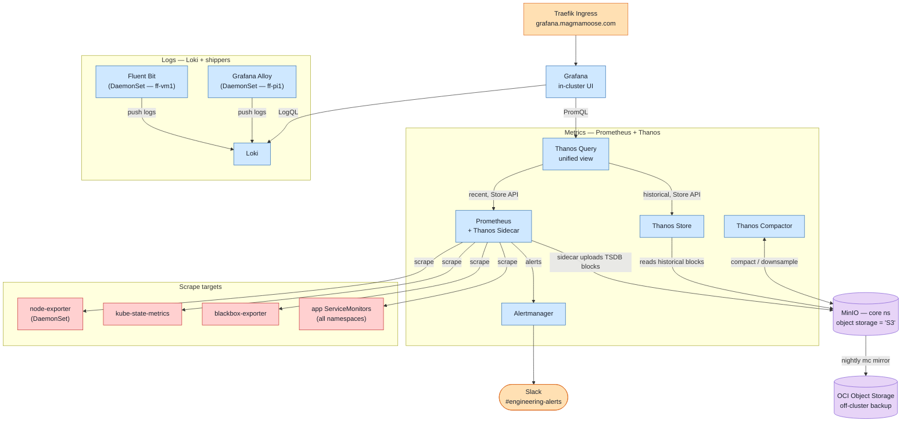

# Observability Stack (Firefly)

A self-hosted **Prometheus + Thanos + Loki + Grafana** stack running entirely inside the
**firefly** k3s cluster (`observability` namespace), with **MinIO** as the object-storage
backend instead of AWS S3. Metrics, logs and alerting all flow end to end:

- **Metrics** — Prometheus scrapes the cluster and uploads long-term blocks to MinIO via a
  Thanos sidecar; Thanos Query gives Grafana one seamless view over recent + historical data.
- **Logs** — every node ships container logs to Loki; Grafana queries them with LogQL.
- **Alerting** — Prometheus rules fire into Alertmanager, which posts to Slack.

It's the firefly translation of an originally AWS-targeted design:

| AWS design | Firefly equivalent | Notes |
|------------|--------------------|-------|
| S3 | **MinIO** (`minio.core.svc.cluster.local:9000`) | In-cluster object storage in the `core` namespace; buckets `thanos-metrics`, `loki-chunks`, `loki-ruler` |
| AMG (Amazon Managed Grafana) | **In-cluster Grafana** | Deployed by the kube-prometheus-stack Helm chart; exposed at `grafana.magmamoose.com` via Traefik |
| ALB | **FortiGate LB + Traefik** | FortiGate handles north-south; in-cluster apps (incl. Grafana) are fronted by Traefik |
| EBS | **local-path PVCs** (ff-vm1) | Per-workload volumes; durability comes from the MinIO→OCI backup, not volume replication |
| Slack | **Slack** | `#engineering-alerts`, via the Slack Web API with a bot token |

## Architecture

### Data flows

- **Metrics (short-term):** Prometheus scrapes exporters and app `ServiceMonitor`s, keeping a
  7-day local retention window on its PVC.
- **Metrics (long-term):** the Thanos sidecar uploads completed TSDB blocks to MinIO. Thanos
  Compactor compacts/downsamples them; Thanos Store serves them back over the Store API.
- **Unified query:** Thanos Query fans out to the Prometheus sidecar (recent) and Thanos Store
  (historical) so Grafana sees one seamless metrics source.
- **Logs:** Fluent Bit (ff-vm1) and Grafana Alloy (ff-pi1) tail container logs and push them to
  Loki with a shared label schema; Grafana queries Loki with LogQL.
- **Alerting:** Prometheus evaluates rules and pushes alerts to Alertmanager, which posts critical
  alerts to Slack.

## Components

All components run in the `observability` namespace (MinIO is in `core`). Pinned to `ff-vm1`
(the 16 vCPU / 32 GiB node) unless noted; Grafana runs on `ff-pi1` where its PV lives.

| Component | Kind | Role | Defined in |
|---|---|---|---|
| **kube-prometheus-stack** | HelmRelease | Prometheus, Grafana, Alertmanager, kube-state-metrics, node-exporter, the operator | `apps/kube-prometheus-stack/` |
| **Prometheus + Thanos sidecar** | StatefulSet | Scrape + 7-day retention; sidecar uploads blocks to MinIO | helmrelease `prometheus.prometheusSpec` |
| **Thanos Query** | Deployment (2×) | Unified PromQL over sidecar + store | `apps/thanos-query/` |
| **Thanos Store** | StatefulSet | Serves historical blocks from MinIO | `apps/thanos-store/` |
| **Thanos Compactor** | StatefulSet | Compaction / downsampling / retention in MinIO | `apps/thanos-compactor/` |
| **Alertmanager** | StatefulSet | Routes alerts to Slack `#engineering-alerts` | helmrelease `alertmanager` |
| **Loki** | StatefulSet | Log store (single-binary, chunks in MinIO) | `apps/loki/` |
| **Fluent Bit** | DaemonSet | Log shipper for `ff-vm1` (and any amd64 node) | `apps/fluent-bit/` |
| **Grafana Alloy** | DaemonSet | Log shipper for `ff-pi1` (see [Logs](#logs-two-shippers)) | `apps/alloy/` |
| **blackbox-exporter** | Deployment | HTTP/ICMP probes via a `Probe` CR | `apps/blackbox-exporter/` |
| **MinIO** | StatefulSet | S3-compatible object storage | `infrastructure/services/stack/minio/` |

## Operations

### Secrets — OCI Vault ExternalSecrets

All credentials are pulled from **OCI Vault** via the `oci-vault` `ClusterSecretStore` (no secret
material in Git). Per-user MinIO passwords live in OCI Vault as `minio-{root,thanos,loki,postgres}-password`;
the Thanos object-store config and Grafana admin password are rendered by templated `ExternalSecret`s.

!!! note "ExternalSecret file naming"
    `.gitignore` ignores `*secret.yaml`. Name ExternalSecret files exactly `externalsecret.yaml`
    or `externalsecret-<purpose>.yaml` — **not** `<x>-externalsecret.yaml` (which ends in
    `secret.yaml` and is silently dropped from commits).

### Resource sizing — KRR, no CPU limits

Resources are sized from the weekly **KRR** report (`apps/krr/`). The convention: set CPU
**requests** but **no CPU limits**, and size **memory** request ≈ limit to real usage.

!!! tip "Why no CPU limits"
    CPU *limits* cause CFS throttling that fires false "at limit" alerts even when the node is
    idle. KRR recommends dropping them; ff-vm1 (16 vCPU / 32 GiB) has ample headroom.

### Storage & backup

Observability PVCs use `local-path` on `ff-vm1`. Durability comes from object storage, not volume
replication: the `minio-backup` CronJob `mc mirror`s `thanos-metrics`, `loki-chunks` and
`loki-ruler` to **OCI Object Storage** nightly (additive — historical blocks are retained even
after the source compacts them). The OCI `minio-backups` bucket is provisioned by the terraform
`backups` module.

### Access

Grafana is exposed at **`grafana.magmamoose.com`** through Traefik (cert-manager `letsencrypt-dns`,
`websecure`), the same pattern as the other in-cluster apps. It's a LAN-only host: the record is
DNS-only (grey cloud) and resolves to a private `192.168.x` IP, so it only works on the LAN/VPN. Prometheus, Alertmanager and the
Thanos components remain ClusterIP-only — reach them with `kubectl port-forward`.

### Logs — two shippers

Logs are collected by two agents writing to the same Loki with a shared label schema
(`cluster=firefly`, `k8s_namespace_name` / `k8s_pod_name` / `k8s_container_name`):

- **Fluent Bit** on `ff-vm1` (and any amd64 node), `job="fluentbit"`.
- **Grafana Alloy** on `ff-pi1`, `job="alloy"`.

!!! info "Why two shippers"
    The Raspberry Pi (`ff-pi1`) runs an arm64 kernel with **16 KB memory pages**, and the
    fluent-bit image's jemalloc is built for 4 KB pages — it crashes with
    `<jemalloc>: Unsupported system page size`. Grafana Alloy is Go, so it's page-size-agnostic.

Query Pi-node logs with `{job="alloy"}` and the rest with `{job="fluentbit"}`; namespace/pod/
container labels are consistent across both.

## Known limitations (homelab)

- **Single replicas** for Prometheus, Alertmanager and Loki. HA needs a second `mini`-labelled
  node (and, for Loki, a shared ring instead of the in-memory one). Thanos Query runs 2×.
- **ff-pi1 is memory-saturated** by over-provisioned non-observability apps, so Alloy runs
  BestEffort (zero memory request). Right-sizing those apps per KRR would free room.
- **No volume replication** — PVCs are node-local on `ff-vm1`. The MinIO→OCI backup is the
  durability layer; Longhorn for the big PVCs is intentionally *not* used (they're reconstructable
  from MinIO, which is itself backed up).

## History — how the stack was brought to green

The stack was audited and repaired in mid-2026 (PRs
[#351](https://github.com/CalebSargeant/infra/pull/351),
[#352](https://github.com/CalebSargeant/infra/pull/352),
[#355](https://github.com/CalebSargeant/infra/pull/355)). It had been largely non-functional; the
root causes are worth recording because they shaped the current design:

- **A committed placeholder S3 credential** (`thanos-secret-key-change-me`) never matched MinIO, so
  Thanos uploaded nothing — the `thanos-metrics` bucket sat at 0 objects and there was no long-term
  metrics path. Fixed by sourcing the credential from OCI Vault (and the chart needs the
  `objectStorageConfig.existingSecret` form, not the flat `name/key`).
- **MinIO's 157 MiB memory limit** OOM-flapped, which cascaded into a Loki crashloop (chunks
  couldn't flush). Fixed by right-sizing MinIO and Loki and adding Loki ingester back-pressure.
- **Grafana crashlooped** on two `isDefault: true` datasources and a PV/affinity rollout deadlock.
  Fixed with `defaultDatasourceEnabled: false` and pinning Grafana to the node holding its PV.
- **Fluent Bit ran on one node only** and fed Loki its own logs (a feedback loop). Fixed with an
  `Exclude_Path` and by adding Alloy for the Pi.

A secondary blocker surfaced during rollout: the **Kyverno admission-controller** was crashlooping
on an over-aggressive liveness probe; its fail-closed webhook intermittently `502`'d and blocked
Helm upgrades. Mitigated by running 2 admission replicas — a durable probe/HA fix in the Kyverno
HelmRelease is a tracked follow-up.
