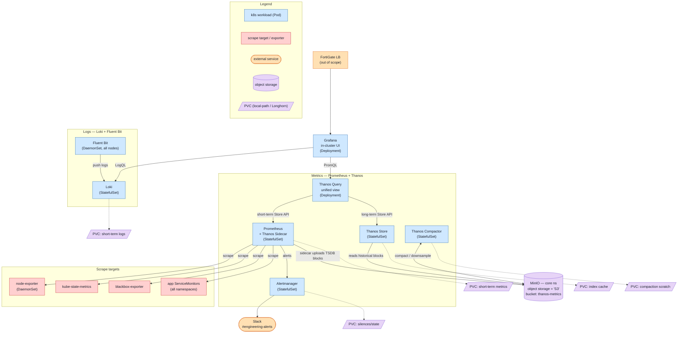

# Observability Stack (Firefly)

A self-hosted Prometheus + Thanos + Loki + Grafana stack running entirely inside the
**firefly** k3s cluster (`observability` namespace), with **MinIO** as the object-storage
backend instead of AWS S3.

This is the firefly translation of an originally AWS-targeted design:

| AWS design | Firefly equivalent | Notes |
|------------|--------------------|-------|
| S3 | **MinIO** (`minio.core.svc.cluster.local:9000`, bucket `thanos-metrics`) | In-cluster object storage in the `core` namespace |
| AMG (Amazon Managed Grafana) | **In-cluster Grafana** (`kube-prometheus-stack-grafana`) | Deployed by the kube-prometheus-stack Helm chart |
| ALB | **FortiGate LB** | Out of scope for this stack — north-south ingress only |
| EBS | **Longhorn / local-path / hostPath PVCs** | Per-workload persistent volumes |
| Slack | **Slack** | Unchanged — `#engineering-alerts` |

## Target architecture



### Data flows

- **Metrics (short-term):** Prometheus scrapes exporters and app ServiceMonitors, keeping a
  short local retention window on a PVC.
- **Metrics (long-term):** the Thanos sidecar uploads completed TSDB blocks to MinIO.
  Thanos Compactor compacts/downsamples them; Thanos Store serves them back over the Store API.
- **Unified query:** Thanos Query fans out to the Prometheus sidecar (recent) and Thanos Store
  (historical) so Grafana sees one seamless metrics source.
- **Logs:** Fluent Bit (DaemonSet on every node) tails container logs and pushes them to Loki;
  Grafana queries Loki with LogQL.
- **Alerting:** Prometheus evaluates rules and pushes alerts to Alertmanager, which routes to Slack.

## Current state vs. target (gap analysis)

> Audited against the live `firefly` cluster on 2026-06-10. The data-collection
> foundation is healthy and **Alertmanager → Slack works end-to-end**, but most of the
> "store, query, and view" layer is broken or degraded — roughly **40% of the way to a
> fully working stack**. Two shared root causes do most of the damage: a **placeholder
> MinIO credential committed to Git**, and an **undersized MinIO memory limit**.

### Status at a glance

| Component | Status | Why |
|---|---|---|
| Alertmanager → Slack | 🟢 working | Real bot token from OCI Vault; alerts flowing, Slack posts delivered, 0 failures. Only gap: 1 replica vs 2. |
| Exporters (node-exporter / kube-state-metrics) | 🟢 working | node-exporter on both nodes, KSM up, cross-namespace scrape selectors are match-all. |
| Prometheus (short-term metrics) | 🟡 degraded | Ingesting fine, but the Thanos sidecar uploads nothing and only 1 replica runs (design wants 2). |
| MinIO / object storage | 🟡 degraded | Runs but **OOM-flaps on a 157Mi limit**; single-node hostPath SPOF; no off-cluster backup. |
| Fluent Bit | 🟡 degraded | Pinned to `type=mini` → only ff-vm1; ff-pi1 (control-plane) logs uncollected; no Loki/namespace exclusion. |
| blackbox-exporter | 🟡 degraded | Probes **nothing**: `--config.file` commented out, 0 `Probe` CRs, restricted probeSelector; orphan PV/PVC. |
| Grafana (UI) | 🔴 broken | ~8,500 restarts/50d — **two `isDefault:true` datasources** fail provisioning; rollout wedged on a PV/affinity deadlock. |
| Loki (logs) | 🔴 broken | ~2,400-restart crashloop — OOM from un-flushable chunks (MinIO down) + a self-ingestion feedback loop. |
| Thanos Query / Store / Compactor | 🔴 broken | Store **scaled to 0 in Git**; Query sees only the sidecar; compactor fails every tick on the bad S3 credential. |

### How the failures cascade

The breakages are not independent — they fan out from the two shared root causes:

- **The placeholder S3 credential poisons the whole Thanos chain.** The SOPS secret
  `thanos-objstore-config` ships `secret_key: thanos-secret-key-change-me`, which does **not**
  match the real MinIO `thanos` user password (in `core/minio-credentials`). That one committed
  line breaks three things at once: the Prometheus Thanos sidecar can't upload TSDB blocks (and
  separately wasn't even rendered with the objstore config — it logs *"no supported bucket was
  configured, uploads will be disabled"*), so `thanos-metrics` holds **0 objects**; the
  **compactor** crashes every ~60s with `SignatureDoesNotMatch`; and a scaled-up **Store** would
  equally fail to read. On top of that, **Thanos Store is deliberately `replicas: 0`** via a
  "temporarily scale down to free resources" patch. Net effect: **every historical query silently
  returns only the last ~7 days of Prometheus data — there is no long-term metrics path at all.**
- **The MinIO 157Mi limit is the upstream cause of the Loki outage.** MinIO OOM-kills repeatedly;
  while it's down mid-PUT, every Loki chunk flush aborts with `IncompleteBody / 400`. Chunks can't
  drain to object storage, so they pile up in Loki's ingester memory until Loki hits its own 2Gi
  limit and is OOM-killed (~4-minute lifetime). **Fluent Bit amplifies this**: with no `Exclude_Path`
  it tails Loki's own crashloop logs and ships them back into Loki as a single ~2.2GB stream that can
  never flush. So Loki dies for an *upstream* reason (MinIO), not because its own memory is too low.
- **Grafana blinds the UI independently.** Even with healthy data nobody could see it: the chart's
  built-in `Prometheus` datasource and the repo's `Thanos` datasource are **both** `isDefault: true`,
  which fails provisioning ("Only one datasource per organization can be marked as default"). A second
  fault compounds it — the rollout is wedged because the new pod requires the `mini` node (ff-vm1) but
  its RWO local-path PV is pinned to ff-pi1, where the old crashlooping pod still holds it.

### Remediation roadmap

Prefer GitOps: edit repo files and let Flux reconcile. SOPS secrets must be decrypted, edited, and
**re-encrypted (`sops -e -i`)** before commit. A few unavoidable manual steps (pod restarts to pick up
new secrets, deleting the orphaned Grafana ReplicaSet) are flagged.

#### P0 — Restore the broken core

| # | Action | File(s) | Risk · Effort |
|---|--------|---------|---------------|
| P0-1 | **Fix the MinIO/Thanos credential split-brain.** Set `config.secret_key` to the real MinIO `thanos` password (= `core/minio-credentials.thanos-password`), re-encrypt, commit. *Manual:* restart `prometheus-prometheus-prometheus-0` and `thanos-compactor-0`. **Done:** compactor stops logging `SignatureDoesNotMatch`; `thanos-metrics` is no longer 0 objects. | `kube-prometheus-stack/base/.../thanos-objstore-secret.enc.yaml` | low · small |
| P0-2 | **Bump MinIO memory** from `157Mi` to **512Mi–1Gi** (request+limit). Upstream fix for MinIO flapping *and* the Loki OOM. **Done:** `minio-0` stops OOMKilling; Loki flushes stop returning `IncompleteBody 400`. | `infrastructure/services/stack/minio/statefulset.yaml` | low · trivial |
| P0-3 | **Re-enable Thanos Store.** Delete the `op: replace … /spec/replicas value: 0` patch block (base already declares `replicas: 2`). **Done:** Thanos Query `/api/v1/stores` lists both a `sidecar` and a `store`; a >7-day query returns data. | `apps/thanos-store/base/thanos-store/kustomization.yaml` | medium · trivial |
| P0-4 | **Fix Thanos sidecar object-store wiring.** HelmRelease declares `prometheusSpec.thanos.objectStorageConfig` but the live STS lacks `--objstore.config-file` + the secret volume — force an operator re-render. **Done:** sidecar args include `--objstore.config-file`; logs no longer say "uploads will be disabled"; blocks appear in `thanos-metrics`. | `kube-prometheus-stack/base/.../helmrelease.yaml` | medium · small |
| P0-5 | **Unbreak Grafana datasources.** Add `defaultDatasourceEnabled: false` under `grafana.sidecar.datasources` so the repo's `Thanos` is the sole default. **Do not delete** the `prometheus-grafana-*` ConfigMaps — they belong to the current release (the prefix is just `fullnameOverride: prometheus`). **Done:** provisioning succeeds, pod reaches 3/3. | `kube-prometheus-stack/base/.../helmrelease.yaml` | low · trivial |
| P0-6 | **Unwedge the Grafana rollout.** Add `deploymentStrategy.type: Recreate` and resolve the PV/affinity contradiction (move Grafana to Longhorn, or align `affinity` to the node where the PV lives). *Manual:* delete the orphaned Pending ReplicaSet if not GC'd. **Done:** exactly one Grafana ReplicaSet `desired=ready=1`. | `kube-prometheus-stack/base/.../helmrelease.yaml` | medium · small |
| P0-7 | **Break the Loki feedback loop.** Add `Exclude_Path` for Loki/Fluent-Bit (ideally the whole `observability` namespace) to the Fluent Bit `[INPUT] tail`. **Done:** Loki stops ingesting its own `{k8s_container_name="loki"}` stream. *(With P0-2, Loki should exit crashloop.)* | `apps/fluent-bit/base/fluent-bit/configmap.yaml` | low · trivial |

#### P1 — Match the design intent

| # | Action | File(s) | Risk · Effort |
|---|--------|---------|---------------|
| P1-1 | **Fluent Bit on all nodes.** Remove the `components/node-selectors/mini` reference; the existing `NoSchedule` toleration lets it land on ff-pi1 (image is multi-arch). **Done:** `ds fluent-bit` DESIRED 2, one pod per node. | `apps/fluent-bit/base/fluent-bit/kustomization.yaml` | low · trivial |
| P1-2 | **Loki: shorten retention + add back-pressure.** Drop `retention_period` 720h → 168h; add `chunk_idle_period` / `max_chunk_age` / rate limits; remove the dead `common.storage.filesystem` block (chunks already go to s3). | `apps/loki/base/loki/configmap.enc.yaml` (SOPS) | medium · medium |
| P1-3 | **Prometheus + Alertmanager HA (2 replicas).** Set `replicas: 2` for both **and** first fix the HA blocker: only ff-vm1 has `node-role.kubernetes.io/mini` — label ff-pi1 or relax the affinity, else the 2nd replica stays Pending. Set an explicit Longhorn `storageClassName` on `storageSpec`. | `kube-prometheus-stack/base/.../helmrelease.yaml` | medium · small |
| P1-4 | **blackbox-exporter — actually probe.** Uncomment `--config.file`; add a `Probe` CR (labeled `release: kube-prometheus-stack`) or set `probeSelectorNilUsesHelmValues: false`. Remove the orphan `pv.yaml`/`pvc.yaml`. | `apps/blackbox-exporter/base/blackbox-exporter/{deployment,kustomization}.yaml` | low · small |
| P1-5 | **Expose Grafana on the LAN via Traefik** (FortiGate stays out of scope). Set `grafana.ingress.enabled: true` with an `ingressClassName` + host, matching the ~45 existing Traefik ingresses. | `kube-prometheus-stack/base/.../helmrelease.yaml` | low · small |

#### P2 — Hardening

- **P2-1 · Off-cluster MinIO backup** — `mc mirror` CronJob of `thanos-metrics`/`loki-*` to OCI Object Storage (mirror the Postgres OCI-backup pattern). *(medium · medium)*
- **P2-2 · Move MinIO + observability PVCs onto Longhorn** — MinIO is `replicas:1` on raw hostPath; all observability PVCs are local-path (node-pinned). Node/disk loss = total data loss. Evaluate Pi I/O first. *(high · large)*
- **P2-3 · Single-source credentials via ExternalSecret** — migrate `minio-credentials` to OCI Vault / 1Password (like postgres/cloudflared/external-dns) and have `thanos-objstore-config` reference the same source — prevents the drift that caused P0-1. *(medium · medium)*
- **P2-4 · Secure Grafana admin password** — replace the plaintext `adminPassword` placeholder with `grafana.admin.existingSecret` from an ExternalSecret. *(low · small)*
- **P2-5 · Fluent Bit filesystem buffering** — add `storage.type filesystem` + a buffer volume so a Loki outage doesn't silently drop logs. *(medium · small)*
- **P2-6 · Right-size Thanos Query** — raise memory above the current request==limit==100Mi before store-gateway fan-out load. *(low · trivial)*

### Design-vs-reality deltas

- **Replica counts (fixable):** design wants **2×** Prometheus / Alertmanager / Thanos Query / Thanos Store / Loki. Firefly runs 1× Prometheus, 1× Alertmanager, 2× Query (met), **0× Store** (Git-scaled-down), 1× Loki. HA is structurally blocked by the single `mini`-labelled node (ff-vm1).
- **Storage class (intentional, durability gap):** EBS → **local-path** for every observability PVC and **raw hostPath** for MinIO. Functional but non-replicated.
- **Loki topology (intentional, caps HA):** single-binary Loki with an in-memory ring (`replication_factor: 1`) — cannot safely scale to 2 without moving the ring to memberlist.
- **Retention drift:** Loki `retention_period` is 720h (30d) — *long*-term, contradicting the design's "short-term" log intent.
- **Slack delivery (intentional, arguably better):** uses the Slack Web API `chat.postMessage` with a bot token, not the classic incoming-webhook URL the design implies.
- **Exposure (scope change + gap):** ALB → FortiGate LB is out of scope, but no in-cluster path was substituted — observability is ClusterIP-only despite Traefik fronting ~45 other apps (see P1-5).
- **Fluent Bit coverage (unintentional):** "all nodes" intent unmet — the `type=mini` selector leaves ff-pi1 logs uncollected (P1-1).

## Implementation status & rollout steps

The change set that gets the stack green is implemented as a single GitOps PR. Secrets were
migrated to **OCI Vault ExternalSecrets** (vault `fruyd6i7aagf4`, store `oci-vault`) and every
workload was **re-sized from the KRR report with CPU limits removed** (CPU limits caused CFS
throttling that fired false "at limit" alerts while ff-vm1 — 16 vCPU / 32 GiB — sat idle).

**Implemented (Flux reconciles on merge):**

| Area | Change |
|------|--------|
| Thanos auth (P0) | `thanos-objstore-config` → ExternalSecret templating `objstore.yml` with the real MinIO `thanos` password from OCI Vault (was a SOPS placeholder → 0-object bucket). New vault secrets: `minio-{root,thanos,loki,postgres}-password`. |
| MinIO (P0) | memory `157Mi` → `512Mi` (was OOM-flapping, the upstream cause of the Loki OOM). `minio-credentials` → ExternalSecret. |
| Thanos Store (P0) | replicas `0` → `1`; request `1.5Gi` (covers index-cache + chunk-pool); no CPU limit. |
| Grafana (P0) | `defaultDatasourceEnabled: false` (single default datasource → no more crashloop); pinned to **ff-pi1** where its PV lives + `Recreate` strategy (unwedges the rollout); admin password → ExternalSecret; no CPU limit. |
| Loki (P0) | memory `2Gi` → `3Gi` (KRR working set ~2.3 GiB); no CPU limit. |
| Fluent Bit (P0/P1) | removed `mini` node-selector → runs on **all nodes**; `Exclude_Path` for Loki/Fluent-Bit logs (breaks the self-ingestion OOM loop). |
| Blackbox (P1) | enabled `--config.file`; added a `Probe` CR + `probeSelectorNilUsesHelmValues: false`; removed orphan PV/PVC. |
| Sizing (P1) | Prometheus `8Gi`→`3Gi`, Thanos query/compactor/sidecar right-sized; CPU limits dropped across the stack. |

### Rollout outcome (completed)

The stack was rolled out to green live. The whole pipeline now works end to end: Prometheus
scrapes → the Thanos sidecar **uploads TSDB blocks to MinIO** → Thanos Store serves them →
Thanos Query unifies short + long-term → Grafana queries it; Fluent Bit → Loki → Grafana for
logs; Prometheus → Alertmanager → Slack for alerts.

A few things surfaced during rollout that needed follow-up fixes (PR #352):

- **Thanos object-storage schema.** The sidecar kept logging `uploads will be disabled` even after
  the credential fix: chart 68.2.2 needs `thanos.objectStorageConfig.existingSecret.{name,key}`,
  not the flat `{name,key}` form (which it silently drops). Fixed in the HelmRelease.
- **Loki.** 3Gi wasn't enough during catch-up; bumped to 4Gi and tuned the (SOPS-encrypted) config —
  retention `720h → 168h`, ingester back-pressure (`chunk_idle_period 5m`, `max_chunk_age 1h`) and
  ingestion rate limits — to bound memory. The 9-day crashloop backlog was wiped (junk) for a clean start.
- **Fluent Bit can't run on the Pi.** With the `mini` selector removed it scheduled onto ff-pi1 and
  crashed with `<jemalloc>: Unsupported system page size` — the Pi's arm64 kernel uses 16KB pages and
  the image's jemalloc is built for 4KB. It's now pinned off `node-role.kubernetes.io/pi`.
- **Kyverno (pre-existing, not part of this stack).** The `kyverno-admission-controller` was
  crashlooping on a failing liveness probe; its fail-closed webhook 502'd intermittently and blocked
  the kube-prometheus-stack helm upgrade. Mitigated by running 2 admission replicas; needs a proper
  fix (probe tolerance / resources) in the Kyverno HelmRelease.

**To make it durable** (the live state currently rides on imperative patches): merge PR #352, then
```bash
flux resume kustomization prod-loki prod-fluent-bit          # un-suspend (held during rollout)
flux suspend helmrelease kube-prometheus-stack -n observability && \
flux resume  helmrelease kube-prometheus-stack -n observability   # clear the failed/stalled upgrade
```

**Verify green:** `thanos-metrics` bucket non-empty (`ls /data/thanos-metrics` in `minio-0`); Thanos
Query `/api/v1/stores` lists both a `sidecar` and a `store`; Grafana `3/3`; `loki-0` `1/1`.

### Deferred (not required for green)

- **ff-pi1 log collection** — the Pi can't run the fluent-bit image (16KB pages). Use a Go/Rust
  shipper there instead (Grafana Alloy / Vector / Promtail).
- **Grafana LAN exposure** via Traefik (the repo's IngressRoute + oauth2-proxy pattern) — its own
  focused change so auth isn't mis-configured. Until then, reach Grafana via `kubectl port-forward`.
- **HA (2× replicas)** for Prometheus/Alertmanager/Loki — needs a second `mini`-labelled node or
  relaxed affinity (and a shared ring for Loki); single replicas are the accepted homelab posture.
- **Durability:** move MinIO + observability PVCs off node-local `local-path`/hostPath onto
  Longhorn, and add an off-cluster `mc mirror` backup of the buckets to OCI.
