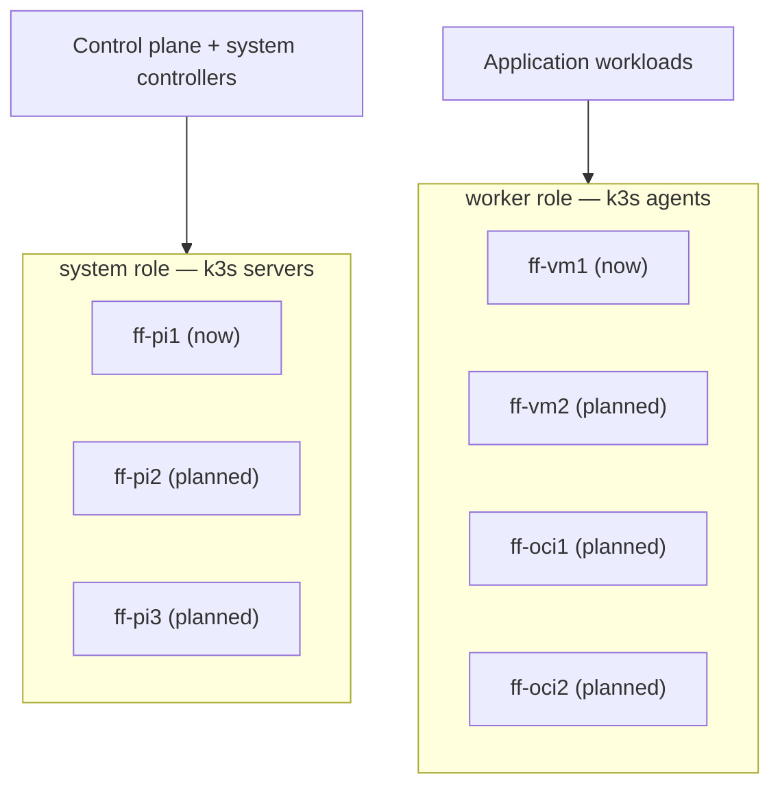

# Cluster Topology: system vs worker nodes

The firefly k3s cluster has two **node roles**, which map directly onto k3s's
server/agent split. Understanding this mapping is the key to deciding *where a
workload should run*.

## The two roles

| Role | k3s role | Runs | Current node(s) | Planned | Labels |
|------|----------|------|-----------------|---------|--------|
| **system** | k3s **server** (control plane) | API server, scheduler, controller-manager, kine **plus** the cluster's system controllers (helm-controller, flux-\*, kyverno, gatekeeper, cert-manager, external-secrets, longhorn-manager, 1Password Connect, …) | **ff-pi1** (Raspberry Pi 5, arm64, 8 GiB) | ff-pi2, ff-pi3 (more Pi5s — control-plane HA / more system capacity) | `node-role.kubernetes.io/system`, legacy `type=pi` / `node-role.kubernetes.io/pi` |
| **worker** | k3s **agent** | Application workloads | **ff-vm1** (amd64, 16 vCPU / 32 GiB) | ff-vm2, ff-oci1, ff-oci2 (OCI free-tier VMs) | `node-role.kubernetes.io/worker`, legacy `type=mini` / `node-role.kubernetes.io/mini` |



!!! note "Naming: pi == system, mini == worker"
    The repo historically named these roles after the **hardware** (`pi`, `mini`).
    They are now also exposed under **role-based** names (`system`, `worker`) which
    describe *intent* and survive hardware changes (e.g. an amd64 system node, or a
    Pi worker). The hardware names remain as **aliases** during migration. Prefer the
    role names for new and migrated workloads.

## Choosing where a workload runs

- **System controllers** (anything that operates the cluster itself) → `system`.
- **Everything else** (applications) → `worker`.

The goal is for **ff-pi1 to run only control-plane + system controllers**, leaving
headroom for the API server, scheduler, and node-level DaemonSets
(node-exporter, fluent-bit, Alloy). The Pi is **memory-request bound** (8 GiB),
so a single over-provisioned app reservation there is expensive.

## How it's codified

### Node labels

```bash
# Applied to the live nodes (cluster-admin / `ember` context):
kubectl label node ff-pi1 node-role.kubernetes.io/system=""  --overwrite
kubectl label node ff-vm1 node-role.kubernetes.io/worker=""  --overwrite
```

!!! warning "Labels must persist across node re-registration"
    `kubectl label` is imperative and is lost if a node re-registers. To make the
    role labels durable, add them to each node's **k3s config** via Ansible
    (`node-label:` in `/etc/rancher/k3s/config.yaml` for servers,
    `/etc/rancher/k3s/config.yaml.d/` for agents). Until that Ansible change lands,
    re-apply the commands above after any node rebuild. The legacy `type=` labels
    are set the same way.

### Node-selector components

Kustomize components apply the selector to a workload's pod template
(`kubernetes/components/node-selectors/`):

| Component | Selects | Use for |
|-----------|---------|---------|
| `node-selectors/system` | `node-role.kubernetes.io/system` | control-plane / system controllers |
| `node-selectors/worker` | `node-role.kubernetes.io/worker` | application workloads |
| `node-selectors/pi` | `type=pi` | **legacy alias** for `system` |
| `node-selectors/mini` | `type=mini` | **legacy alias** for `worker` |

Reference one from an app's base `kustomization.yaml`:

```yaml
components:
  - ../../../../components/node-selectors/worker
```

## Storage and the "everything off the Pi" migration

Most legacy stateful apps were pinned to ff-pi1 not by a node-selector but by
**storage**: `hostPath` PVs on the Pi's local disks (`/mnt/nvme/*`, `/mnt/raid/*`,
`/mnt/data/*`) and `local-path` PVs already bound to ff-pi1. A node-selector flip
alone would orphan their data, so moving them off the Pi requires a **data
migration**, not just a label change.

The storage model going forward:

| Need | Backend | Notes |
|------|---------|-------|
| Movable app config / databases | **Longhorn** (`longhorn` SC) | Replicated across nodes (`default-replica-count=2`), so the volume is reachable from any node — this is what un-pins a stateful app from the Pi. |
| Bulk media / downloads | **NFS** (`192.168.19.5:/mnt/raid5/...`) | Network-shared, node-independent. |
| Legacy (being retired) | `hostPath` / `local-path` on ff-pi1 | Node-bound; migrate to Longhorn/NFS, then schedule on `worker`. |
| CloudNativePG instances | CNPG-managed | Drain a node by editing the `Cluster` affinity; CNPG re-replicates — no manual copy. |

!!! info "hostNetwork exceptions"
    `homeassistant` and `homebridge` use `hostNetwork: true` (HomeKit/mDNS). They
    can run on a worker (also on the LAN), but their **advertised IP changes** when
    they move off the Pi — expect HomeKit re-pairing / mDNS cache refreshes.
